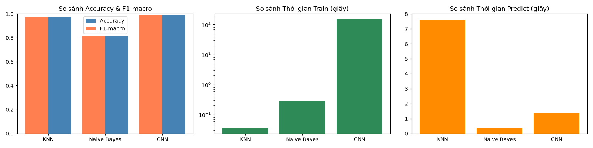

# Nghiên cứu và đánh giá hiệu năng của các thuật toán học máy KNN, Naive Bayes, CNN trên bài toán nhận dạng chữ số viết tay MNIST

Dự án so sánh hiệu suất của 3 thuật toán học máy kinh điển (KNN, Naive Bayes) và học sâu (CNN) trên bài toán phân loại chữ số viết tay MNIST — từ tiền xử lý dữ liệu, tuning hyperparameter, đến đánh giá và phân tích lỗi chi tiết.

## Kết quả tổng quan



| Thuật toán  | Test Accuracy |  F1-macro  | Train Time (s) | Predict Time (s) |
| ----------- | :-----------: | :--------: | :------------: | :--------------: |
| KNN         |    97.17%     |   97.15%   |      0.04      |       7.62       |
| Naive Bayes |    81.40%     |   81.23%   |      0.29      |       0.34       |
| **CNN**     |  **99.18%**   | **99.17%** |     150.79     |       1.39       |

## Nhận xét chính

- **CNN** đạt độ chính xác cao nhất nhờ học được đặc trưng không gian qua các lớp tích chập (convolution), nhưng cần thời gian train lâu hơn đáng kể.
- **KNN** là "lazy learner" — gần như không mất thời gian train (chỉ lưu dữ liệu), nhưng bù lại thời gian predict rất chậm vì phải so sánh khoảng cách với toàn bộ tập train.
- **Naive Bayes** có tốc độ nhanh nhất ở cả train và predict, nhưng độ chính xác thấp hơn hẳn do giả định "các pixel độc lập với nhau" không phù hợp với dữ liệu ảnh (các pixel liền kề trong 1 nét vẽ vốn có tương quan cao).
- Các lỗi nhầm lẫn phổ biến nhất ở KNN tập trung vào các cặp số có hình dạng nét vẽ tương đồng (ví dụ 4↔9, 7↔1, 8↔3, 8↔5).

## Cấu trúc dự án

```
mnist-knn-nb-cnn/
├── src/
│   ├── data_loader.py      # Tải & tiền xử lý dữ liệu MNIST
│   ├── eda.py               # Khám phá dữ liệu (phân bố lớp, ảnh mẫu)
│   ├── knn_model.py         # KNN: tuning (GridSearchCV) + đánh giá
│   ├── nb_model.py          # Naive Bayes: tuning + đánh giá
│   ├── cnn_model.py         # CNN: kiến trúc, train, đánh giá
│   └── evaluate.py          # Tổng hợp & so sánh 3 thuật toán
├── results/
│   ├── figures/              # Biểu đồ, confusion matrix, learning curves
│   └── metrics/               # Kết quả dạng JSON/CSV
├── models/                    # Model CNN đã train (.keras)
└── requirements.txt
```

## Cài đặt & Chạy

```bash
# Clone dự án
git clone https://github.com/duyendo15/mnist-knn-nb-cnn
cd mnist-knn-nb-cnn

# Tạo và kích hoạt virtual environment
python -m venv venv
.\venv\Scripts\Activate.ps1   # Windows PowerShell

# Cài thư viện
pip install -r requirements.txt

# Chạy từng thuật toán
python src/eda.py
python src/knn_model.py
python src/nb_model.py
python src/cnn_model.py
python src/evaluate.py
```

## Phương pháp

1. **EDA**: kiểm tra phân bố lớp (tương đối cân bằng), trực quan hóa ảnh mẫu
2. **Tiền xử lý**: chuẩn hóa pixel [0,1]; flatten ảnh cho KNN/NB, giữ dạng 2D cho CNN
3. **Tuning**: GridSearchCV 5-fold cho KNN (k, weights, metric) và Naive Bayes (var_smoothing)
4. **CNN**: kiến trúc 3 lớp Conv2D + MaxPooling, Dropout 0.5 chống overfitting, 93,322 tham số
5. **Đánh giá**: Accuracy, F1-macro, confusion matrix, thời gian train/predict cho cả 3 mô hình

## Công nghệ sử dụng

Python · scikit-learn · TensorFlow/Keras · NumPy · Pandas · Matplotlib · Seaborn

## Tác giả

Mỹ Duyên — [github.com/duyendo15](https://github.com/duyendo15)
